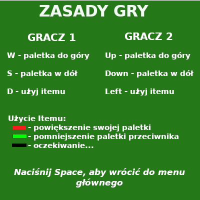

# Ping-pong
> Ping-pong is a 2D game for 2 players.

## General info
Application is written in C++. That's my first time when I used OOP. The game is for 2 players. 
The winner is a player who will get 11 points first. The best TOP10 results are written to a txt file.

## Rules

Player1:
* W - UP
* S - DOWN
* D - using item

Player2:
* UP - UP
* DOWN - DOWN
* LEFT - using item

Item:
* Red - size up paddle
* Green - size down opponent's paddle
* Black - waiting..

## Technologies
* SFML - version 2.5.1

